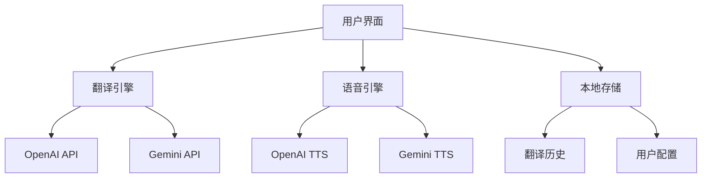

<div align="center">


# Clear Trans

### 🚀 新一代 AI 翻译工具

> 极简设计 · 双引擎驱动 · 开源免费

[](https://choosealicense.com/licenses/mit/)
[](https://nextjs.org/)
[](https://www.typescriptlang.org/)
[](https://github.com/CooperJiang/ClearTrans)

[🌐 **立即体验**](https://translate.mmmss.com/) · [📖 **使用文档**](#使用指南) · [🐛 **问题反馈**](https://github.com/CooperJiang/ClearTrans/issues)

</div>

---

## ✨ 为什么选择 Clear Trans？

<table>
<tr>
<td width="50%">

### 🎯 **双引擎智能**
- **OpenAI GPT** - 精准理解上下文
- **Google Gemini** - 多语言优化
- **智能切换** - 自动选择最佳模型
- **100+ 语言** - 覆盖全球主流语言

</td>
<td width="50%">

### 🛠️ **灵活部署**
- **服务端模式** - 零配置即用
- **客户端模式** - 自定义API密钥
- **一键部署** - 支持Docker/Vercel
- **私有化** - 完全控制数据安全

</td>
</tr>
<tr>
<td width="50%">

### 🎨 **极简体验**
- **现代界面** - 简洁直观的设计
- **实时翻译** - 流式输出，即时反馈
- **快捷操作** - 键盘快捷键支持
- **响应式** - 完美适配各种设备

</td>
<td width="50%">

### 🔊 **语音合成**
- **多种声音** - OpenAI 19种 + Gemini 30种
- **风格控制** - 语速、音调、情感调节
- **高质量** - 接近真人的语音效果
- **多语言** - 支持多种语言发音

</td>
</tr>
</table>

---

## 🚀 快速开始

### 📦 一键部署

```bash
# 克隆项目
git clone https://github.com/CooperJiang/ClearTrans.git
cd ClearTrans

# 安装依赖
npm install

# 配置环境变量（可选）
cp env.example .env.local

# 启动服务
npm run dev
```

### 🌐 在线体验

无需安装，直接访问：**[translate.mmmss.com](https://translate.mmmss.com/)**

---

## ⚙️ 配置指南

### 环境变量配置

创建 `.env.local` 文件（可选，用于服务端模式）：

```bash
# 基础配置
PORT=8888
NEXT_PUBLIC_APP_NAME=Clear Trans

# OpenAI 配置
OPENAI_API_KEY=your_openai_api_key
OPENAI_BASE_URL=https://api.openai.com/v1

# Gemini 配置
GEMINI_API_KEY=your_gemini_api_key
GEMINI_BASE_URL=https://generativelanguage.googleapis.com/v1beta
```

### 部署模式选择

| 模式 | 适用场景 | 配置要求 |
|------|----------|----------|
| **客户端模式** | 个人使用 | 用户自行配置API密钥 |
| **服务端模式** | 团队/企业 | 管理员预配置API密钥 |

---

## 🎛️ 功能特色

### 🌍 智能翻译
- **自动检测** - 智能识别源语言
- **上下文理解** - 保持语义连贯性
- **格式保持** - 维持原文结构
- **批量处理** - 支持长文本翻译

### 🔊 语音合成
- **多模型支持** - OpenAI TTS + Gemini TTS
- **声音选择** - 49种不同风格声音
- **参数调节** - 语速、音调自定义
- **风格控制** - 情感、语调精细控制

### 💾 智能记忆
- **翻译历史** - 自动保存翻译记录
- **快速重用** - 一键重新翻译
- **本地存储** - 数据完全私有
- **导出功能** - 支持多种格式导出

---

## 🛠️ 技术架构

<div align="center">



</div>

### 核心技术栈

- **前端框架**: Next.js 15 + React 19
- **开发语言**: TypeScript
- **样式方案**: Tailwind CSS
- **AI 服务**: OpenAI API + Google Gemini API
- **部署平台**: Vercel / Docker / 自托管

---

## 🤝 参与贡献

我们欢迎所有形式的贡献！

### 贡献方式

- 🐛 **报告问题** - [提交 Issue](https://github.com/CooperJiang/ClearTrans/issues)
- 💡 **功能建议** - [功能请求](https://github.com/CooperJiang/ClearTrans/issues/new)
- 🔧 **代码贡献** - [提交 PR](https://github.com/CooperJiang/ClearTrans/pulls)
- 📖 **文档改进** - 完善使用文档

### 开发流程

1. **Fork** 本仓库
2. **创建** 功能分支
3. **提交** 代码更改
4. **发起** Pull Request

---

## 📄 开源协议

本项目基于 [MIT License](LICENSE) 开源协议，你可以自由使用、修改和分发。

---

<div align="center">

### 🌟 如果这个项目对你有帮助

**请给我们一个 Star ⭐️**

[](https://star-history.com/#CooperJiang/ClearTrans&Date)

---

**Made with ❤️ by Clear Trans Team**

[🏠 首页](https://translate.mmmss.com/) · [📚 文档](https://github.com/CooperJiang/ClearTrans) · [💬 讨论](https://github.com/CooperJiang/ClearTrans/discussions)

</div>
